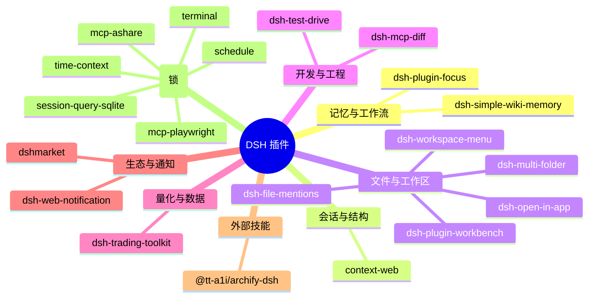

# dsh-plugin-management（插件驾驶舱）

> 分类盘点 DSH web profile 的所有用户插件，在**设置面板**里逐项「启用/停用」（停用=不加载、**不卸载**），核心/基础能力**锁死**，每次变更自动**备份 + 校验 + 提示重启**。

## 能力

- 设置页新增「插件管理」章节：按分类分组列出全部插件（名称/版本/描述/加载形态/核心标记）+ 每项「启用/停用」开关。
- 启停机制：
  - **bundle 类**（在 `dsh.profile.bundles`）：启用=加回 bundles；停用=移出 bundles（依赖保留）。
  - **patch 类**（挂在 cordis.patch.yml 的行）：启用=移除 `disabled: true` 行；停用=追加该行。
- **核心/基础锁死**（`@deepseek-ai/*`、terminal、schedule、mcp-*、session-query-*、time-context 等）不可停用。
- 变更前备份 profile 三件套到 `$DSH_HOME/dsh-plugin-management/backups`；变更返回「需重启 dsh web 生效」。
- **变更安全链（0.3.0，2026-09-12 硬化）**：写前校验（JSON 可解析 / bundles 合法 / 无 tab 缩进 / 目标效果可复核）→ **原子写**（同目录临时文件 + rename）→ **写后读回复核** → 不符即**回滚原文**。失败原因以人话回传（`validate-failed` / `write-failed` / `verify-failed`），并说明 profile 有没有被动过。
- patch 行编辑已覆盖：引号 id、同一 id 出现在多个 insert 块（全部命中）、已有 `disabled: false` 改写而非追加重复键。
- 变更后可用 `dsh --profile web --dump-config` 校验组合无错误（人工步骤；插件内的等价校验见上一条）。

## 变更记录

- **0.3.0**（2026-09-12）— #3 硬化：写前校验 + 原子写 + 写后复核 + 失败回滚；patch 行编辑修三个真实缺陷（引号 id、多 insert 块只改一处、`disabled: false` 时追加出重复键）；失败文案人话化。测试 19/19。
- **0.2.0**（2026-09-06）— 按需插件停用回顾提醒（14 天周期，`/review` API + 面板提醒卡）。

## 插件分类总览（Mermaid）



## 安装

```powershell
dsh plugin --profile web add <path-to-dsh-plugin-management>
dsh web
```

重启后在 **设置 → 插件管理** 查看/启停。

## 开发

```powershell
npm install --legacy-peer-deps
npm test          # inventory + patch-ops 单元测试
npm run build     # host 语法检查 + tsdown 打包 client
```

## 许可

MIT。
